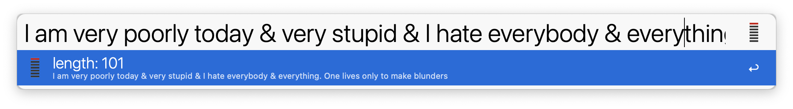

# alfred-line-a-day
 one-line-a-day journal

If you, like [John Quincy Adams](https://www.masshist.org/jqadiaries/php/how#:~:text=Line%2Da%2Dday%20entries%20are,%22%20(diary%20volume%2023)), like to summarize a day in one line (typically ~100 characters), this simple workflow will add a timestamp and save it in your `txt` or `md` file.

